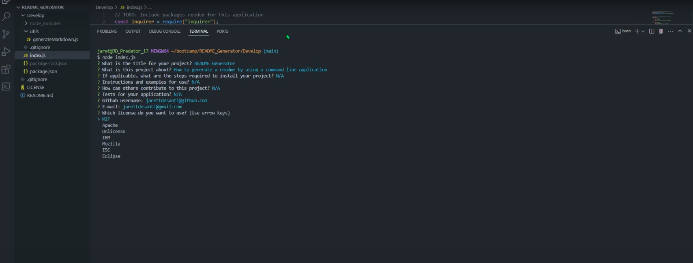
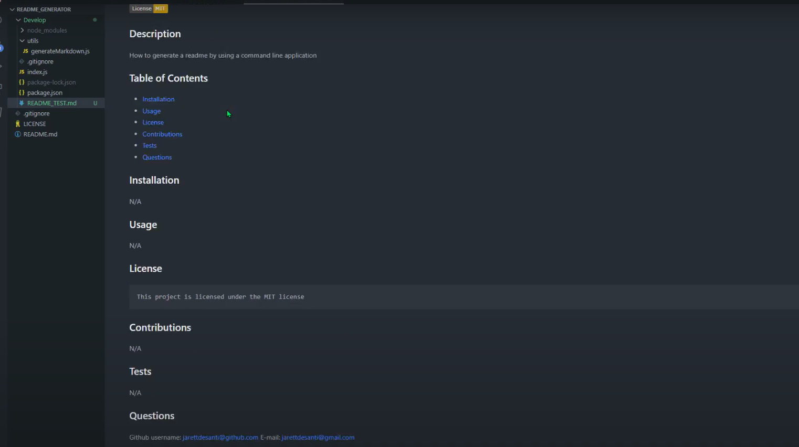

# JD_README_GENERATOR

## Description

This readme contains information on the README generator project using Node.js. This README generator allows users to generate a README file. The user will answer questions and the user input is then used to create the README file. 

## Installation

N/A

## Usage

In order to use this README generator, the user must open the index.js file located in this repository and run the command "node index.js" in the terminal. The user is then given a series of questions to answer, in order to generate the README file. The README file will then be generated after answering all questions and the user can click on the newly created file to view their README.

## Links

Github repository URL: https://github.com/JarettDeSanti/README_Generator  
Demo URL: https://drive.google.com/file/d/1IW_3iOcKTyVeMXr29KL5XyoU3sMN224J/view

## Screenshot

## Credits

## Acknowledgements 

Jarett DeSanti, Pakapong Mongkol, Richard Song

## License

Please refer to the LICENSE in the repository.

## Badges
N/A

## Features
N/A

## How to Contribute
N/A

## Tests
N/A
